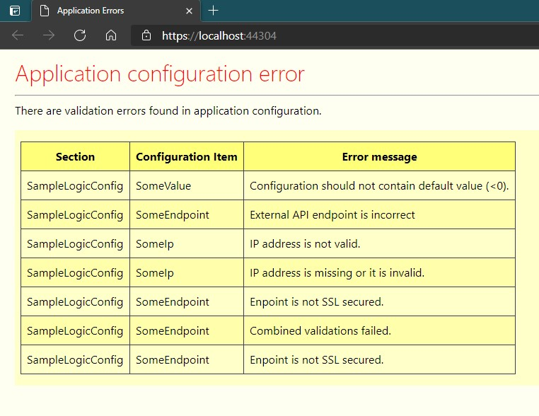

# ConfigurationValidation.AspNetCore

Incorporates usage of [ConfigurationValidation](https://www.nuget.org/packages/ConfigurationValidation/) within Asp.Net (Core) applications.\
Provides three ways of handling invalid configurations:
- Request filter preventing application startup on invalid configuration
- Root page (yellow page of error) displaying incorrect configuration values
- Health check for configuration

Also provides extension shorcuts for configuration validation usage in Asp.Net application for easy functionality registrations.

[](https://github.com/salixzs/AspNetCore.HealthCheck/actions/workflows/build_test.yml)
[](https://www.nuget.org/packages/ConfigurationValidation.AspNetCore/)
[](https://www.nuget.org/packages/ConfigurationValidation.AspNetCore/) (since 6-Jan-2023)

#### If you use or like...

Cosider "star" this project and/or better\
<a href="https://www.buymeacoffee.com/salixzs" target="_blank"></a>

### Member of Salix.AspNetCore.Utilities packages

See also other packages for some other/related functionality in Asp.Net Core (mostly APIs):
- [JSON Error handler](https://www.nuget.org/packages/Salix.AspNetCore.JsonExceptionHandler/)
- [API dynamic FrontPage (with binaries versioning approaches)](https://www.nuget.org/packages/Salix.AspNetCore.FrontPage/)
- [Health check with JSON result + Health page](https://www.nuget.org/packages/Salix.AspNetCore.HealthCheck/)

## ConfigurationValidation

Main functionality, which is wrapped here has its own repository ([Click HERE](https://github.com/salixzs/ConfigurationValidation)) explaining Configuration validation approach.
It has documentation describing how to create validatable configuration objects in application(s).

## ASP.NET Integration

All usage is set up in `program.cs` file.
See also repository Sample project on real implementation.

```csharp
public class Program
{
    public static void Main(string[] args)
    {
        var builder = WebApplication.CreateBuilder(args);

        // <----- Register validatable configuration(s) you define in your app (see ConfigurationValidation package on how to create these).
        builder.Services.ConfigureValidatableSetting<SampleLogicConfig>(builder.Configuration.GetSection("LogicConfiguration"));

        // <----- Enabling this will prevent app startup when config is wrong (should see startup logging for troubleshooting)
        // builder.Services.AddConfigurationValidation();

        // <----- Add Health check for configuration (also enable app.UseHeathChecks() below)
        // builder.Services.AddConfigurationHealthCheck(builder.Environment.IsDevelopment());

        builder.Services.AddControllers();


        var app = builder.Build();
        app.UseHttpsRedirection();

        // <----- Displays yellow screen of error when config is wrong (only for root URL ("/")
        app.UseConfigurationValidationErrorPage();

        // <----- Enable together with builder.Services.AddConfgurationHealthCheck() above.
        // app.UseHealthChecks("/health");

        app.UseAuthorization();
        app.MapControllers();
        app.Run();
    }
}
```

Code above displays all three approaches (two of them commented out).

## Configuration object registration

Package has extension methods to register defined validatable configuration objects with dependency injection container.\
They register both object itself and IOptions<> instances with container.

```csharp
// Program.cs
var builder = WebApplication.CreateBuilder(args);
builder.Services.ConfigureValidatableSetting<MyConfigClass>(builder.Configuration.GetSection("MyConfigSection"));

// Register non-validatable configuration settings class
builder.Services.ConfigureSetting<MyConfigClass>(builder.Configuration.GetSection("MyConfigSection"))
```

##  Prevent startup (Filter)

```csharp
// Program.cs
var builder = WebApplication.CreateBuilder(args);
builder.Services.AddConfigurationValidation();
```


## Yellow error page

Is shown when root page is invoked (https://myaspnetapp.com/) when configuration is invalidated. If configuration is correct - displays normal root page (if one exists).
Does not show page or impact any sub-routes work (if they still work with incorrect configuration).

```csharp
// Program.cs
var builder = WebApplication.CreateBuilder(args);
// ...

var app = builder.Build();
app.UseConfigurationValidationErrorPage();
// ...
```




## Health check

Adds health check for validatable configuration objects.\
NOTE: Someone should invoke health check to actually see configuration is broken (or use monitoring tools to get notified on that).

```csharp
// Program.cs
var builder = WebApplication.CreateBuilder(args);
builder.Services.AddConfigurationHealthCheck(builder.Environment.IsDevelopment());
// ...

var app = builder.Build();
app.UseHealthChecks("/health");
// ...
```
